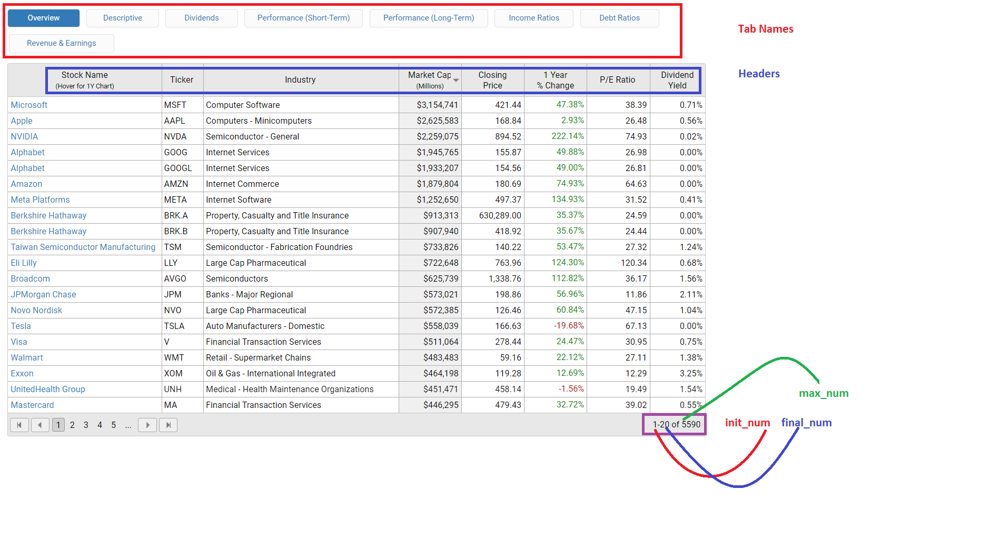
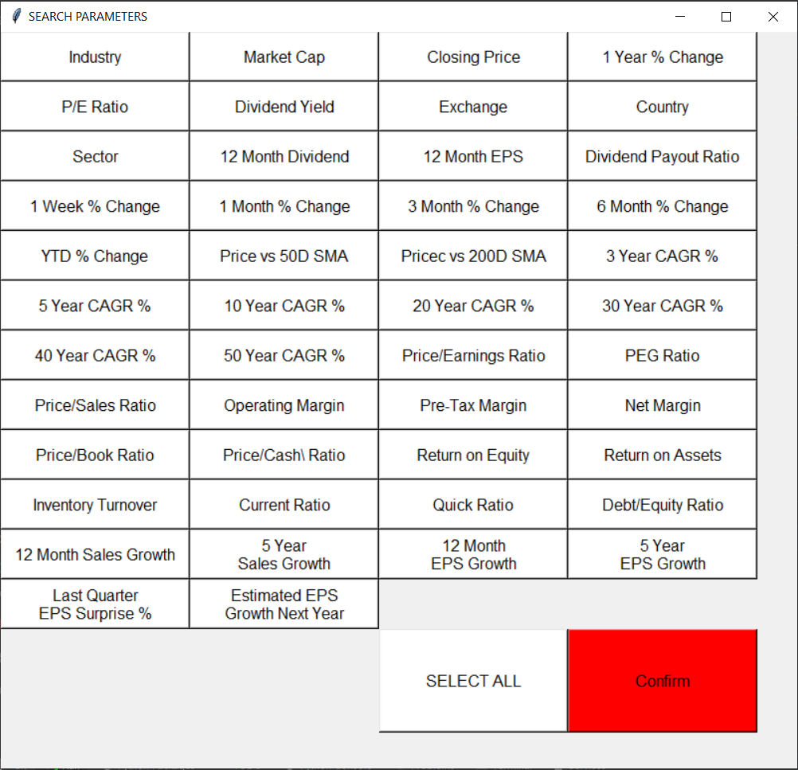

# MacroTrend Data Scrapper

Package to be used to scrap the desired data in the table given in MacroTrend website accessed with the url below: <br />
https://www.macrotrends.net/stocks/stock-screener
<br />
When the url above is clicked a table which is full of companies 
and their attributes (such as dividend yield, market cap etc.) is seen.
An example of the table is given in the Figure below:




This packages enable users to scrap all (or some) of the data 
and save it into a `.csv` file. This package simply be used by
calling main.py via command line. It will automatically open a GUI 
which enables users to select which parameters to be scrapped. 
Below, the GUI (which enables users to select
parameters) is seen.



More details on the usage of the package is explained in the followings.

## Installation

### Prerequisites

- Python 3.x is installed to your system

### Installation Steps

1. Clone this repository to your local machine

` git clone git@github.com:AlpSari/MagicInvest.git 
 `
2. Go to the directory

`cd MagicInvest
`
3. (Optional) Create a Python virtual environment and activate it:

`python -m venv venv
`

From Windows command prompt (i.e., cmd), activate the virtual environment by:

`venv\Scripts\activate
`

4. Install the required dependencies using pip:

`pip install -r requirements.txt
`

5. (Optional) Install developer tools if you would like to contribute to the project:

`pip install -r dev_requirements.txt
`

### Running the Data Scrapper

To run the data scrapper the below line can be executed in the command line:

`python main.py
`

When the `main` executed in this way, it runs with its default settings. With the default settings, the parameters desired to be scrapped is selected by the user via a GUI, then all scrappings is saved to "output.csv" in the current directory.  

However, this is not the only way to execute `main`. It can also be executed by providing arguments which are explained below:

`--parameters-path
`
 :Input of this argument is the path to the .JSON file 
which stores the parameters to be scrapped. 
User can avoid using the GUI by creating a .JSON file 
(storing parameters to be scrapped) and providing 
its path via command line. Please note that, the format of the .JSON file should
be as given below:

```json
["param1", "param2", ..., "paramN"]
```


`--output-csv
`
 :Input of this argument is the name of the .CSV file in which scrapped parameters to be saved.

`--logging-level
`
:Input of this argument controls the logging level of Logger object. The valid arguments are ["none", "info", "debug"].


Example usage of the arguments are given below:

`python main.py --parameters-path this/is/my/path.JSON --output-csv my_file.csv --logging-level none
`
## Note To Developers

Developers should use the same code checking tools that are being used by the Github actions. Those are automatically configured using configuration files in the repository and all the tools and plugins can be downloaded using:

```bash
pip install -r dev_requirements.txt
```

## Git Branch Naming Convention

1. No commit to master
2. FEATURES: feature/...
3. BUGFIX: bugfix/...
4. SANDBOX: sandbox/...

## Testing

Unit tests for the package are available in the `tests/` directory. To run the tests, use the following command:

`python -m unittest discover -v tests`

Note that some of the GUI-related tests are causing display errors(in remote server); therefore, they are not implemented yet.
